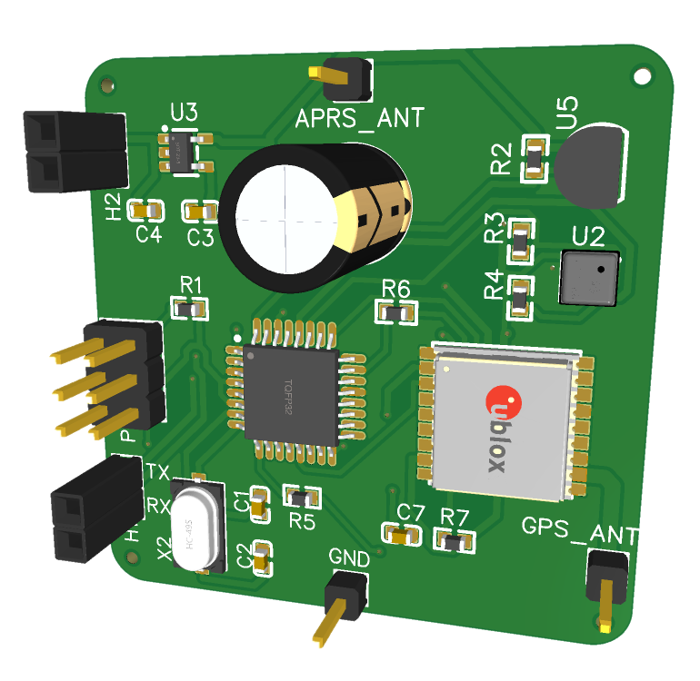
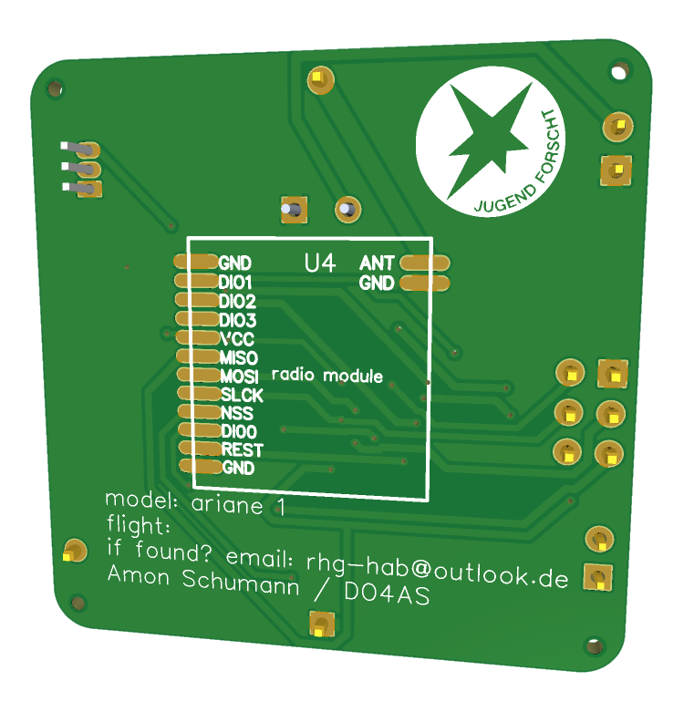
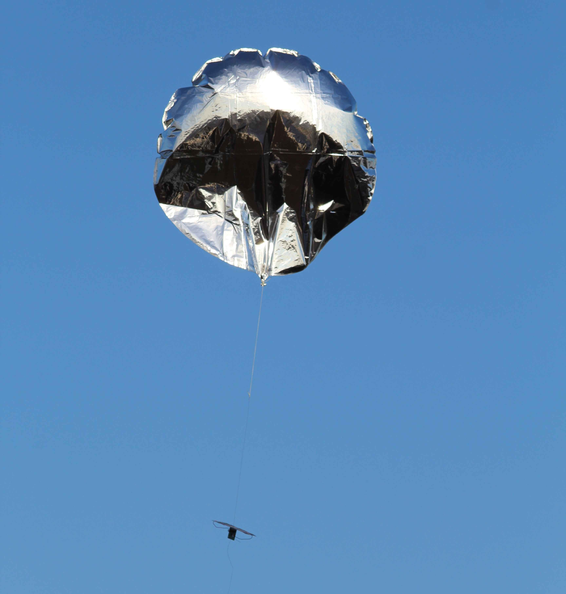
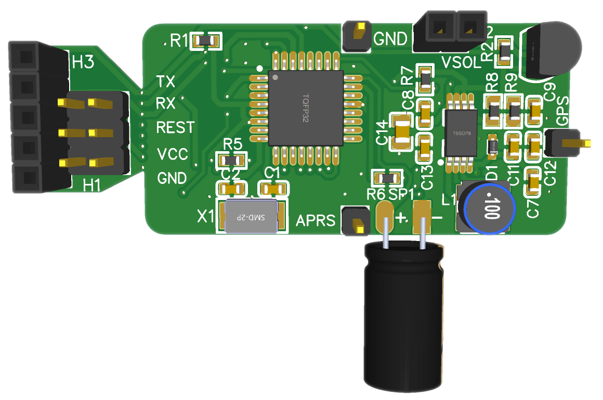
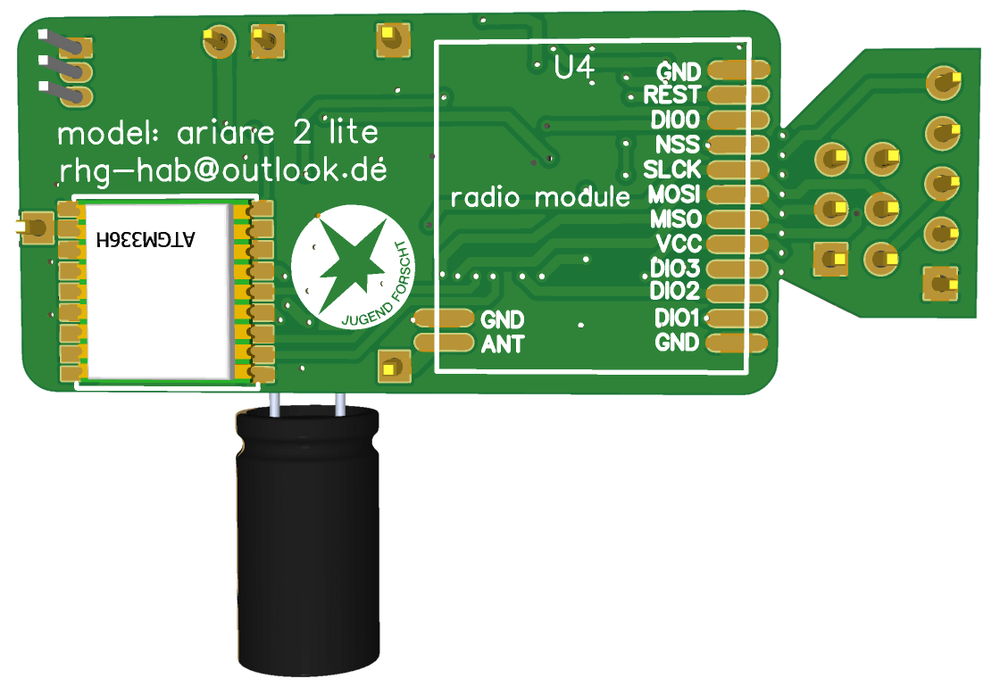

# "Jugend Forscht": radiosonde project

see https://do4as.github.io/ for more balloon flight information and some balloon calculator utilities

#### first radiosonde version:

| front view                                                   | back view                                                    |
| ------------------------------------------------------------ | ------------------------------------------------------------ |
|  |  |

 **Figure 1** - radiosonde-1 pcb

**Figure 2** - radiosonde-1 without mounted solar panels

**Figure 3** - radiosonde-1 with mounted solar panels

**Figure 4** - radiosonde-1 in the air

**Figure 5** - radiosonde-1 in the air 2

#### second  radiosonde version:

| front view                                                   | back view                                                    |
| ------------------------------------------------------------ | ------------------------------------------------------------ |
|  |  |

 **Figure 6** - radiosonde-2 pcb

| front view                                                   | back view                                                    |
| ------------------------------------------------------------ | ------------------------------------------------------------ |
|  |  |

 **Figure 7** - radiosonde-2-lite pcb

 **Figure 8** - radiosonde-2-lite without mounted solar panels

**Figure 9** - radiosonde-2-lite pcb breakout

**Figure 10** - radiosonde-2-lite solar panels

**Figure 11** - radiosonde-2-lite with mounted solar panels - radiosonde-2-lite weighs only 9.5 g

**Figure 12** - radiosonde-2-lite with mounted solar panels from above