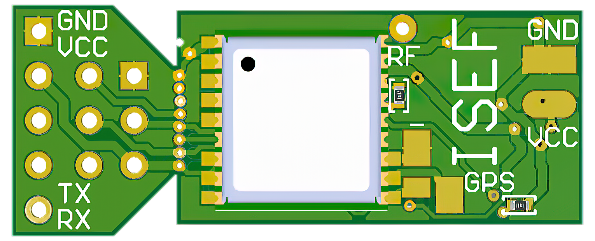

# "Jugend Forscht" / "ISEF": radiosonde project

**see https://do4as.github.io/ for more balloon flight information and some balloon calculator utilities**

---

### third radiosonde version:

| front view                                              | back view                                             |
| ------------------------------------------------------- | ----------------------------------------------------- |
|  |  |

**Figure** - radiosonde-3

**Figure** - radiosonde-3 with mounted solar panels - radiosonde-3 weighs only 4.8 g

### second radiosonde version:

| front view                                                                    | back view                                                                   |
| ----------------------------------------------------------------------------- | --------------------------------------------------------------------------- |
|  |  |

 **Figure** - radiosonde-2-lite pcb

 **Figure** - radiosonde-2-lite without mounted solar panels

**Figure** - radiosonde-2-lite pcb breakout

**Figure** - radiosonde-2-lite solar panels

**Figure** - radiosonde-2-lite with mounted solar panels - radiosonde-2-lite weighs only 7.8 g

**Figure** - radiosonde-2-lite with mounted solar panels from above

### first radiosonde version:

| front view                                                          | back view                                                         |
| ------------------------------------------------------------------- | ----------------------------------------------------------------- |
|  |  |

 **Figure** - radiosonde-1 pcb

**Figure** - radiosonde-1 without mounted solar panels

**Figure** - radiosonde-1 with mounted solar panels

**Figure** - radiosonde-1 in the air

**Figure** - radiosonde-1 in the air 2

### APRS packet description:

 **Figure** - APRS packet description

### ascent phase measurement data

**Figure** - radiosonde ascent profile

**Figure** - radiosonde ascent profile 2

### floating phase measurement data

**Figure** - radiosonde floating profile

**Figure** - radiosonde floating profile 2